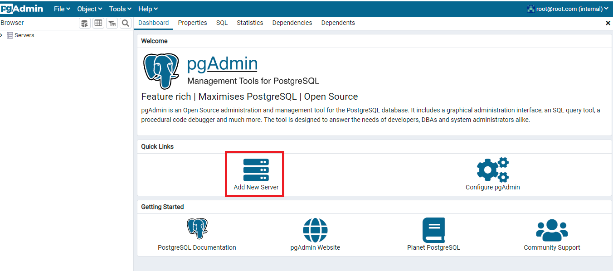
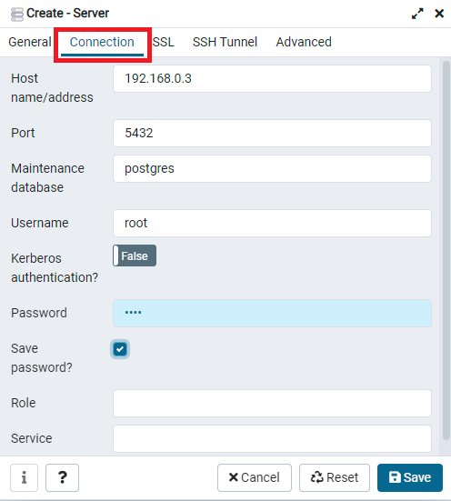
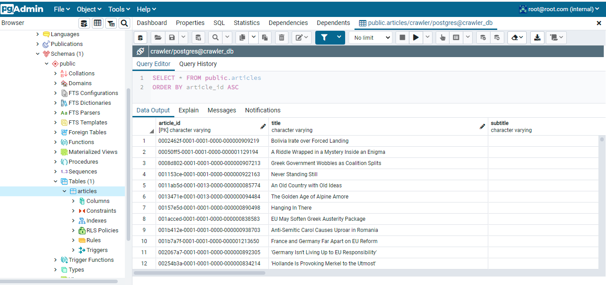

# Spiegel Web Crawler
This is an application that crawls the Spiegel website and stores news article in a database.
The crawler was developed using python, the scrapy framework and Postgresql as a main database to store the data.

# Prerequisite
- Docker available at https://www.docker.com/get-started
- Docker Compose: If you are using Windows or Mac OS, no need to install Docker Compose, since it is included with Docker. However, if you are using Linux, please refer to the installation documentation https://docs.docker.com/compose/install/

# How to install
1)  Download and unzip project or clone this repository using:
    
    ```sh
    git clone https://github.com/nahlaerrakik/SpiegelCrawler.git
    ```
    
2)  Open the `Command Prompt` on your local machine and execute the following commands. Make sure you are at the root of the project:
    
    ```sh
    cd SpiegelCrawler
    docker compose up --build -d
    ```
    
    The installation may take some time to finish. Once finished, the crawler will be triggered and it will start crawling the website https://www.spiegel.de/international/
    
    To stop the application, enter the following command:
    ```sh
    docker compose stop
    ```


# How to visualize data
1) If you stopped the containers at some point, make sure the spiegel_db and spiegel_pgadmin containers are up and running:
   ```sh
   docker container start spiegel_db
   docker container start spiegel_pgadmin
   ```
1) Open your browser and go to http://localhost:5050/login
2) Login to the interface using the following credentials:

   - Login: root@root.com 
   - Password: root
   
   
   
3) Click on "Add New Server"
   
   
4) Add the database server by completing the forms with the following inputs:
   
   General tab:
        
        - Name: crawler_db
        
   
        
   Connection tab:
   
       - Host name/address: copy past the db container's IP address. To retrieve the container's IP address, enter the following command line:
       
            `docker inspect -f "{{range .NetworkSettings.Networks}}{{.IPAddress}}{{end}}" spiegel_db`
       
       - Port: 5432
       - Maintenance database: postgres
       - Username: root
       - Password: root
       - Save password?: ticked
       
   
   
5) Using the right navigation bar, go to articles tables using Servers -> crawler_db -> Databases -> crawler -> Schemas -> public -> Tables -> articles
   right-click on articles and select View/Edit Data -> All Rows
   
   
   


